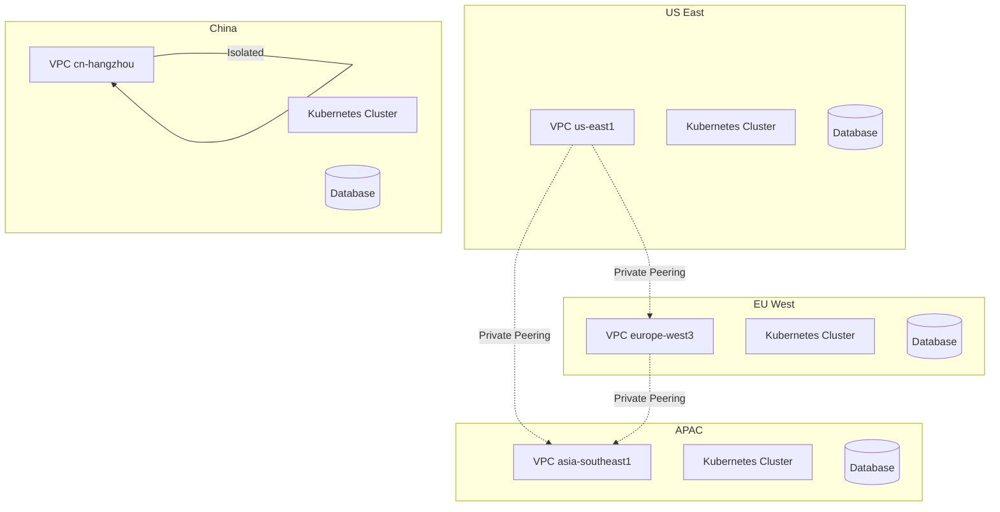

# Multi-Region Deployment Architecture

## Overview

The Cover Generation Tool requires global deployment across 4 primary regions to ensure low latency, data compliance, and high availability for users worldwide.

## 1. Regional Data Centers Strategy

### 1.1 Primary Regions
```yaml
Regions:
  us-east:
    provider: Google Cloud Platform
    location: us-east1 (South Carolina)
    serves: North America, South America
    compliance: CCPA, COPPA
    
  eu-west:
    provider: Google Cloud Platform
    location: europe-west3 (Frankfurt)
    serves: Europe, Middle East, Africa
    compliance: GDPR, Digital Services Act
    
  apac:
    provider: Google Cloud Platform
    location: asia-southeast1 (Singapore)
    serves: Asia Pacific (except China)
    compliance: PDPA, local regulations
    
  china:
    provider: Alibaba Cloud
    location: cn-hangzhou
    serves: Mainland China
    compliance: Cybersecurity Law, PIPL
```

### 1.2 Disaster Recovery Regions
```yaml
DR_Regions:
  us-west: us-west1 (Oregon)
  eu-central: europe-west1 (Belgium)
  apac-secondary: asia-northeast1 (Tokyo)
  china-backup: cn-beijing
```

## 2. Global Load Balancing

### 2.1 DNS-Based Routing with Cloudflare
```yaml
Routing_Strategy:
  primary: geographic_proximity
  fallback: latency_based
  health_checks: every_30_seconds
  
DNS_Configuration:
  - api.covergen.ai -> Global load balancer
  - api-us.covergen.ai -> US region
  - api-eu.covergen.ai -> EU region
  - api-ap.covergen.ai -> APAC region
  - api-cn.covergen.ai -> China region (via Aliyun DNS)
```

### 2.2 Health Check Configuration
```typescript
interface HealthCheck {
  path: "/health";
  interval: 30; // seconds
  timeout: 10;  // seconds
  retries: 3;
  expected_status: 200;
  expected_body: "OK";
}

const regionalHealthChecks = {
  endpoints: [
    "/health/database",
    "/health/redis",
    "/health/ai-service",
    "/health/storage"
  ],
  thresholds: {
    critical: 3, // consecutive failures
    warning: 2
  }
};
```

## 3. Data Replication Architecture

### 3.1 PostgreSQL Multi-Master Setup
```yaml
Database_Replication:
  architecture: multi_master_with_conflict_resolution
  
  primary_databases:
    - us-east: users, payments, analytics
    - eu-west: users, payments, analytics
    - apac: users, payments, analytics
    - china: users_cn, payments_cn, analytics_cn
  
  replication_strategy:
    users: bidirectional_async
    payments: master_per_region
    analytics: write_local_read_global
    
  conflict_resolution:
    method: last_write_wins
    timestamp_column: updated_at
```

### 3.2 MongoDB Replica Sets
```javascript
// MongoDB Replica Set Configuration
const replicaSetConfig = {
  _id: "covergen-global",
  members: [
    { _id: 0, host: "mongo-us-1:27017", priority: 1 },
    { _id: 1, host: "mongo-eu-1:27017", priority: 1 },
    { _id: 2, host: "mongo-ap-1:27017", priority: 1 },
    { _id: 3, host: "mongo-cn-1:27017", priority: 0.5 }
  ],
  settings: {
    chainingAllowed: true,
    heartbeatIntervalMillis: 2000,
    heartbeatTimeoutSecs: 10,
    electionTimeoutMillis: 10000
  }
};
```

### 3.3 Redis Cross-Region Synchronization
```yaml
Redis_Clusters:
  us-east:
    nodes: 6
    replicas: 2
    sync_to: [eu-west, apac]
    
  eu-west:
    nodes: 6
    replicas: 2
    sync_to: [us-east, apac]
    
  apac:
    nodes: 6
    replicas: 2
    sync_to: [us-east, eu-west]
    
  china:
    nodes: 6
    replicas: 2
    isolated: true # No cross-border sync
```

## 4. CDN and Content Delivery

### 4.1 Cloudflare CDN Configuration
```typescript
const cdnConfig = {
  zones: {
    global: "covergen.ai",
    china: "covergen.cn"
  },
  
  cachingRules: {
    images: {
      ttl: 604800, // 7 days
      edgeTtl: 2592000, // 30 days
      browserTtl: 86400 // 1 day
    },
    
    api_responses: {
      ttl: 300, // 5 minutes
      edgeTtl: 60, // 1 minute
      conditions: ["status:200", "method:GET"]
    }
  },
  
  optimizations: {
    minification: true,
    compression: "gzip",
    imageOptimization: true,
    http3: true
  }
};
```

### 4.2 Object Storage Strategy
```yaml
Storage_Regions:
  us-east:
    primary: gs://covergen-us-assets
    backup: gs://covergen-us-backup
    
  eu-west:
    primary: gs://covergen-eu-assets
    backup: gs://covergen-eu-backup
    
  apac:
    primary: gs://covergen-ap-assets
    backup: gs://covergen-ap-backup
    
  china:
    primary: oss://covergen-cn-assets
    backup: oss://covergen-cn-backup

Cross_Region_Replication:
  user_avatars: all_regions
  generated_covers: origin_region_only
  templates: all_regions
  system_assets: all_regions
```

## 5. Multi-Region CI/CD Pipeline

### 5.1 GitHub Actions Workflow
```yaml
name: Multi-Region Deployment

on:
  push:
    branches: [main, staging]

jobs:
  test:
    runs-on: ubuntu-latest
    steps:
      - uses: actions/checkout@v4
      - name: Run tests
        run: npm test

  build:
    needs: test
    runs-on: ubuntu-latest
    steps:
      - name: Build Docker images
        run: |
          docker build -t covergen/api:${{ github.sha }} .
          docker push covergen/api:${{ github.sha }}

  deploy-us:
    needs: build
    runs-on: ubuntu-latest
    environment: production-us
    steps:
      - name: Deploy to US region
        run: |
          kubectl config use-context gke-us-east1
          kubectl apply -f k8s/us/
          
  deploy-eu:
    needs: build
    runs-on: ubuntu-latest
    environment: production-eu
    steps:
      - name: Deploy to EU region
        run: |
          kubectl config use-context gke-europe-west3
          kubectl apply -f k8s/eu/
          
  deploy-apac:
    needs: build
    runs-on: ubuntu-latest
    environment: production-apac
    steps:
      - name: Deploy to APAC region
        run: |
          kubectl config use-context gke-asia-southeast1
          kubectl apply -f k8s/apac/
          
  deploy-china:
    needs: build
    runs-on: ubuntu-latest
    environment: production-china
    steps:
      - name: Deploy to China region
        run: |
          kubectl config use-context ack-cn-hangzhou
          kubectl apply -f k8s/china/
```

### 5.2 Canary Deployment Strategy
```yaml
Canary_Rollout:
  traffic_split:
    - phase1: 5%   # 5 minutes
    - phase2: 10%  # 10 minutes
    - phase3: 25%  # 15 minutes
    - phase4: 50%  # 20 minutes
    - phase5: 100% # Full rollout
    
  success_criteria:
    error_rate: < 0.1%
    latency_p99: < 2000ms
    availability: > 99.9%
    
  rollback_triggers:
    error_rate: > 1%
    latency_increase: > 50%
    health_check_failures: > 5
```

## 6. Compliance and Data Residency

### 6.1 GDPR Compliance (EU Region)
```yaml
GDPR_Measures:
  data_localization:
    - All EU user data stored in europe-west3
    - No cross-border transfers without adequate safeguards
    - Data processing agreements with sub-processors
    
  user_rights:
    - Data portability API: /gdpr/export
    - Right to erasure: /gdpr/delete
    - Consent management: /gdpr/consent
    - Data access requests: /gdpr/access
    
  technical_safeguards:
    - Encryption at rest and in transit
    - Pseudonymization for analytics
    - Regular penetration testing
    - Privacy by design architecture
```

### 6.2 China Compliance
```yaml
China_Requirements:
  data_localization:
    - All China user data in cn-hangzhou
    - No data transfer outside mainland China
    - Local ICP filing and permits
    
  content_moderation:
    - Real-time content review
    - Sensitive word filtering
    - Human moderator queue
    - Government reporting interface
    
  technical_compliance:
    - Multi-level protection scheme (MLPS)
    - Data encryption standards (SM2, SM3, SM4)
    - Audit logs retention (6 months minimum)
```

## 7. Monitoring and Observability

### 7.1 Global Monitoring Dashboard
```yaml
Monitoring_Stack:
  metrics: Prometheus + Grafana
  logs: ELK Stack (Elasticsearch, Logstash, Kibana)
  tracing: Jaeger with OpenTelemetry
  uptime: Pingdom + DataDog Synthetics
  
Dashboards:
  - Global Overview: All regions health
  - Regional Deep Dive: Per-region metrics
  - Service Health: Microservice status
  - User Experience: Latency and errors
  - Business Metrics: Generations, payments
```

### 7.2 Alerting Configuration
```typescript
const alertRules = {
  critical: {
    api_down: "availability < 99%",
    high_latency: "p99_latency > 5000ms",
    generation_failures: "failure_rate > 5%",
    payment_errors: "payment_failure > 1%"
  },
  
  warning: {
    high_cpu: "cpu_usage > 80%",
    high_memory: "memory_usage > 85%",
    queue_backlog: "queue_depth > 1000",
    slow_queries: "db_query_time > 1000ms"
  }
};
```

## 8. Cost Optimization

### 8.1 Resource Allocation Strategy
```yaml
Resource_Planning:
  compute:
    us-east: 40% (largest user base)
    eu-west: 30% (GDPR compliance overhead)
    apac: 20% (growing market)
    china: 10% (separate infrastructure)
    
  storage:
    hot_tier: user_avatars, recent_generations
    warm_tier: templates, 30-day_old_generations
    cold_tier: analytics_data, old_generations
    
  ai_services:
    vertex_ai_quota: distributed_by_region
    fallback_services: activated_on_demand
```

### 8.2 Auto-Scaling Configuration
```yaml
Auto_Scaling:
  metrics:
    - cpu_utilization
    - memory_utilization
    - request_queue_depth
    - generation_queue_length
    
  scaling_policies:
    scale_out:
      threshold: 70%
      cooldown: 300s
      max_instances: 100
      
    scale_in:
      threshold: 30%
      cooldown: 600s
      min_instances: 3
```

## 9. Network Architecture

### 9.1 Inter-Region Connectivity


### 9.2 Bandwidth Optimization
```yaml
Traffic_Optimization:
  cdn_offloading: 85%
  image_compression: webp_format
  api_response_compression: gzip
  
  regional_caching:
    static_assets: 99% cache_hit_ratio
    api_responses: 70% cache_hit_ratio
    database_queries: 60% cache_hit_ratio
```

## 10. Deployment Timeline

### Phase 1: US Region (Weeks 1-2)
- Set up primary US infrastructure
- Deploy all microservices
- Configure monitoring and logging
- Performance testing and optimization

### Phase 2: EU Region (Weeks 3-4)
- Deploy GDPR-compliant EU infrastructure
- Set up database replication
- Configure EU-specific compliance features
- Cross-region testing

### Phase 3: APAC Region (Weeks 5-6)
- Deploy APAC infrastructure
- Optimize for regional latency
- Set up CDN edge locations
- Load testing with regional traffic

### Phase 4: China Region (Weeks 7-8)
- Deploy isolated China infrastructure
- Implement China compliance features
- Set up local monitoring
- Regulatory approval and testing

### Phase 5: Global Optimization (Weeks 9-10)
- Fine-tune global load balancing
- Optimize cross-region costs
- Implement global monitoring
- Disaster recovery testing

This multi-region architecture ensures global scale, compliance, and high availability while maintaining optimal performance for users worldwide.