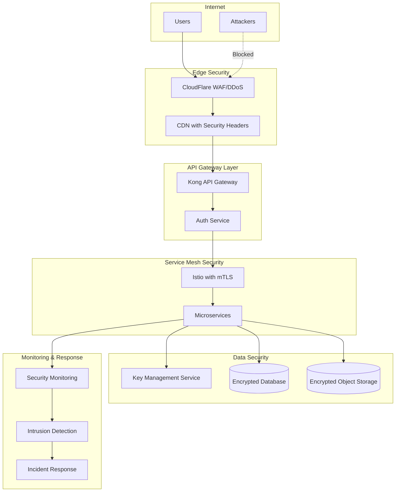

# Security Architecture - Cover Generation Tool

## 1. Authentication Architecture

### 1.1 JWT-Based Authentication Flow
```yaml
Token Structure:
  Access Token:
    - Lifetime: 24 hours
    - Algorithm: RS256
    - Claims: user_id, email, subscription_tier, permissions
  Refresh Token:
    - Lifetime: 30 days (rotating)
    - Stored in secure HTTP-only cookie
    - Rotation on each use
```

### 1.2 OAuth 2.0 Social Login Integration
- **Google OAuth**: Primary social login
- **Implementation**: Authorization Code Flow with PKCE
- **Token Exchange**: Backend handles OAuth token exchange
- **User Mapping**: Link social accounts to internal user IDs

### 1.3 Multi-Factor Authentication (MFA)
```typescript
MFA Options:
  - TOTP (Time-based One-Time Password)
  - SMS OTP (backup method)
  - WebAuthn/FIDO2 (future enhancement)
  
MFA Enforcement:
  - Optional for Free users
  - Mandatory for Pro+ users
  - Required for admin access
```

## 2. Authorization and Access Control

### 2.1 Role-Based Access Control (RBAC)
```yaml
User Roles:
  - free_user: Basic access, 3 daily generations
  - pro_user: Enhanced access, 50 monthly generations
  - pro_plus_user: Premium access, 200 monthly generations
  - admin: Full system access
  
Service Roles:
  - cover_generator: Can create/modify images
  - payment_processor: Can handle transactions
  - content_moderator: Can review/flag content
```

### 2.2 Resource-Level Permissions
```typescript
interface ResourcePermission {
  resource_type: 'cover' | 'template' | 'user_data';
  resource_id: string;
  user_id: string;
  permissions: ['read', 'write', 'delete'];
}
```

### 2.3 API Rate Limiting
```yaml
Rate Limits by Tier:
  Free:
    - 10 requests/minute
    - 100 requests/hour
    - 3 generations/day
  Pro:
    - 30 requests/minute
    - 500 requests/hour
    - 50 generations/month
  Pro+:
    - 60 requests/minute
    - 1000 requests/hour
    - 200 generations/month
```

## 3. Data Security

### 3.1 Encryption Strategy
```yaml
Encryption at Rest:
  - Database: PostgreSQL TDE with AES-256
  - Object Storage: Client-side + server-side encryption
  - Key Rotation: Quarterly for master keys
  
Encryption in Transit:
  - TLS 1.3 minimum for all connections
  - Certificate pinning for mobile apps
  - HSTS with 1-year max-age
```

### 3.2 Key Management Service (KMS)
```typescript
KMS Architecture:
  Primary: Google Cloud KMS
  China Region: Aliyun KMS
  
Key Hierarchy:
  - Master Keys (in HSM)
  - Data Encryption Keys (DEK)
  - Key Encryption Keys (KEK)
```

### 3.3 PII Protection
```yaml
PII Handling:
  - Tokenization for payment data
  - Pseudonymization for analytics
  - Right to erasure (GDPR Article 17)
  - Data minimization principles
```

## 4. Network Security

### 4.1 Zero-Trust Architecture
```yaml
Principles:
  - Never trust, always verify
  - Least privilege access
  - Assume breach mentality
  
Implementation:
  - Service mesh with Istio
  - mTLS between all services
  - Network policies in Kubernetes
```

### 4.2 API Gateway Security
```typescript
Kong Security Plugins:
  - OAuth 2.0 authentication
  - IP restriction by geo-location
  - Bot detection and blocking
  - Request size limiting
  - SQL injection prevention
```

### 4.3 DDoS Protection
```yaml
CloudFlare Protection:
  - Layer 3/4 DDoS mitigation
  - Layer 7 application attacks
  - Rate limiting rules
  - Challenge pages for suspicious traffic
  
Regional Protection:
  - China: Aliyun Anti-DDoS Pro
  - Global: CloudFlare + GCP Cloud Armor
```

## 5. Compliance Framework

### 5.1 GDPR Compliance (EU)
```yaml
Technical Measures:
  - Data portability API endpoints
  - Automated deletion workflows
  - Consent management system
  - Privacy by design architecture
  
Organizational Measures:
  - DPO designation
  - Privacy impact assessments
  - Breach notification procedures (72 hours)
```

### 5.2 China Cybersecurity Law
```yaml
Requirements:
  - Data localization in mainland China
  - Real-name registration
  - Content moderation system
  - Security assessment filing
  
Implementation:
  - Separate China infrastructure
  - Local data storage (Aliyun)
  - Content review queue
```

### 5.3 AI Content Regulations
```typescript
AI Transparency:
  - SynthID watermarking on all generated images
  - C2PA metadata for content provenance
  - Clear AI-generated labels
  - Audit trail for all generations
```

## 6. Security Monitoring

### 6.1 Security Event Logging
```yaml
Log Collection:
  - Centralized logging with ELK stack
  - Security-specific indices
  - 90-day retention minimum
  - Immutable audit logs
  
Key Events:
  - Authentication attempts
  - Authorization failures
  - Data access patterns
  - API abuse attempts
```

### 6.2 Threat Detection
```typescript
Detection Rules:
  - Brute force login attempts
  - Unusual download patterns
  - Suspicious generation requests
  - Account takeover indicators
  - Data exfiltration attempts
```

### 6.3 Incident Response
```yaml
Response Procedures:
  1. Detection & Analysis (15 minutes)
  2. Containment (30 minutes)
  3. Eradication (2 hours)
  4. Recovery (4 hours)
  5. Post-incident review (24 hours)
  
Automation:
  - Auto-block suspicious IPs
  - Account lockout on anomalies
  - Automated alerting
```

## 7. Application Security

### 7.1 Input Validation
```typescript
Validation Rules:
  - Title: Max 200 chars, sanitized
  - File uploads: Type/size validation
  - API inputs: Schema validation
  - SQL parameter binding
  - NoSQL injection prevention
```

### 7.2 OWASP Top 10 Mitigation
```yaml
A01 Broken Access Control:
  - RBAC implementation
  - Resource-level checks
  
A02 Cryptographic Failures:
  - TLS 1.3 enforcement
  - Strong key management
  
A03 Injection:
  - Parameterized queries
  - Input sanitization
  
A04 Insecure Design:
  - Threat modeling
  - Security reviews
  
A05 Security Misconfiguration:
  - Automated hardening
  - Security baselines
```

## 8. Container Security

### 8.1 Image Security
```yaml
Container Scanning:
  - Trivy for vulnerability scanning
  - Image signing with Cosign
  - Distroless base images
  - No root containers
  
Registry Security:
  - Private registry only
  - Image pull secrets
  - Vulnerability policies
```

### 8.2 Kubernetes Security
```yaml
Pod Security Standards:
  - Restricted security context
  - Read-only root filesystem
  - Non-root user enforcement
  - Resource limits
  
Network Policies:
  - Deny all by default
  - Explicit allow rules
  - Service mesh integration
```

### 8.3 Secrets Management
```typescript
Secret Storage:
  - Kubernetes secrets (encrypted)
  - External secrets operator
  - HashiCorp Vault integration
  
Secret Rotation:
  - API keys: 90 days
  - Database credentials: 30 days
  - TLS certificates: Annual
```

## Security Architecture Diagram



## Security Controls Summary

| Layer | Control | Implementation |
|-------|---------|----------------|
| Network | DDoS Protection | CloudFlare, Cloud Armor |
| Transport | Encryption | TLS 1.3, mTLS |
| Application | Authentication | JWT, OAuth 2.0, MFA |
| Application | Authorization | RBAC, Resource Permissions |
| Data | Encryption | AES-256, KMS |
| Data | Privacy | GDPR, Tokenization |
| Infrastructure | Container Security | Image Scanning, PSS |
| Monitoring | SIEM | ELK Stack, Prometheus |
| Compliance | Regulations | GDPR, CCPA, China Laws |
| AI Content | Transparency | SynthID, C2PA |