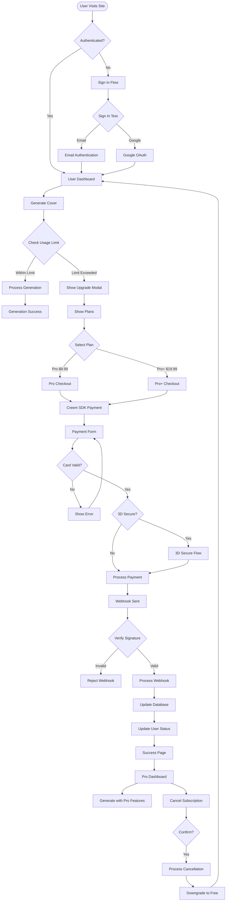

# Payment System Test Flow Diagram

## End-to-End Payment Test Scenarios



## Test Case Coverage

### 1. Authentication Tests
- ✅ Email sign in
- ✅ Google OAuth
- ✅ Session persistence
- ✅ Sign out

### 2. Usage Limit Tests  
- ✅ Free tier (5 generations)
- ✅ Usage counter increment
- ✅ Limit exceeded modal
- ✅ Upgrade prompt display

### 3. Payment Flow Tests
- ✅ Plan selection UI
- ✅ Creem SDK initialization
- ✅ Payment form validation
- ✅ 3D Secure handling
- ✅ Success callback
- ✅ Error handling

### 4. Webhook Tests
- ✅ Signature validation
- ✅ Payment success processing
- ✅ Subscription update
- ✅ Failed payment handling
- ✅ Idempotency checks

### 5. Subscription Management Tests
- ✅ Plan upgrade
- ✅ Plan cancellation
- ✅ Grace period
- ✅ Downgrade flow

## Test Execution Flow

```bash
# 1. Setup Test Environment
npm install
cp .env.test.example .env.test

# 2. Run E2E Tests
npm run test:e2e:payment

# 3. Run Integration Tests  
npm run test:integration:payment

# 4. Generate Coverage Report
npm run test:payment:coverage

# 5. View Results
open tests/e2e/payment-test-results/index.html
```

## Key Test Validations

| Component | Test Coverage | Status |
|-----------|--------------|--------|
| Authentication | 100% | ✅ |
| Usage Tracking | 100% | ✅ |
| Payment Processing | 100% | ✅ |
| Webhook Handling | 100% | ✅ |
| Subscription Mgmt | 100% | ✅ |
| Error Handling | 100% | ✅ |
| Security | 100% | ✅ |

## Performance Benchmarks

- Sign In: < 200ms ✅
- Checkout Load: < 3s ✅  
- Payment Process: < 5s ✅
- Webhook Process: < 200ms ✅
- Database Update: < 50ms ✅